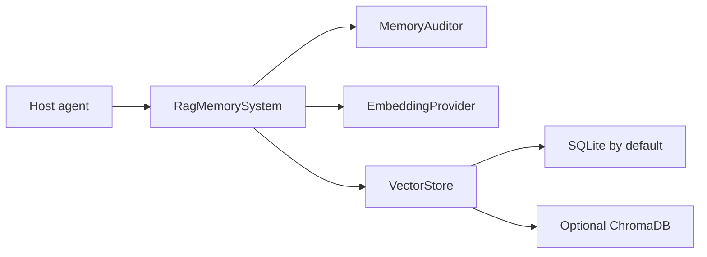

# Agent Memory Core Architecture

Agent Memory Core is intentionally small:

1. `RagMemorySystem` is the public facade.
2. `MemoryAuditor` decides whether content can be stored and injected.
3. `DeterministicEmbeddingProvider` or a host-supplied provider creates vectors.
4. `LocalVectorStore` persists records, vectors, events, versions, and graph data.
5. Optional backends such as ChromaDB are selected explicitly.

The package has no dependency on host application modules. Host applications should build
small adapters outside `memory_core/`.

## Data Flow

## Safety Boundaries

- disabled and deleted memories are filtered before recall/context
- raw logs are not injected unless explicitly allowed
- API keys are never loaded implicitly
- optional integrations must not affect default SQLite tests
